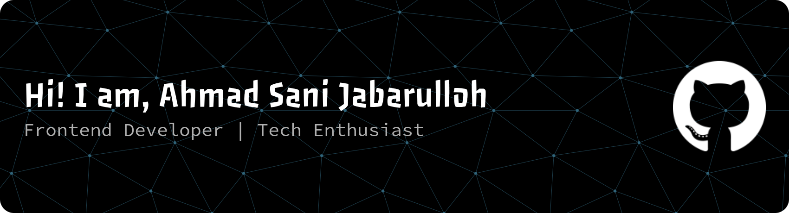

### 👨‍💻 About Me

- 🔭 I’m a passionate **Frontend Developer** who loves building user-friendly and responsive web applications.
- 🌱 Currently exploring and sharpening my skills in modern web technologies and full-stack development.
- 💼 I am highly open to **full-time opportunities, freelance projects, and open-source collaborations**.

### 💻 Technologies and Tools

  
  
  
  
  
  
  
  
  
  
  
  
  
  
  
  
  
  
  
  
  

###

### 🌐 Socials:
   

###

<picture>
  <source media="(prefers-color-scheme: dark)" srcset="https://raw.githubusercontent.com/ahmadsanny02/ahmadsanny02/output/pacman-contribution-graph-dark.svg">
  <source media="(prefers-color-scheme: light)" srcset="https://raw.githubusercontent.com/ahmadsanny02/ahmadsanny02/output/pacman-contribution-graph.svg">
  
</picture>